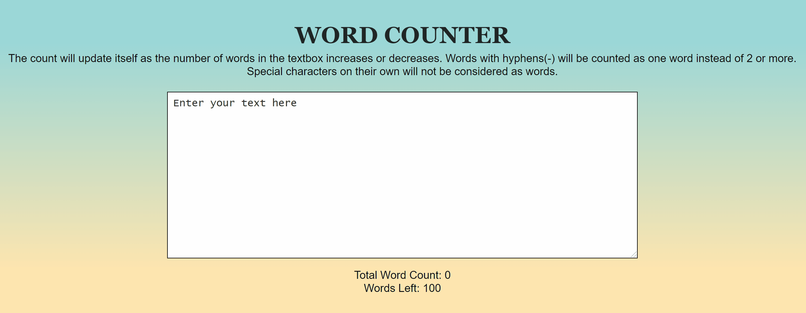

# Word-Counter
A word counter that will update itself as the number of words in the textbox increases or decreases. If the words exceed the maximum limit of 100, the count down number turns red in colour.

#### Regex pattern explained

```let words = input.value.match(/\b(\S+)\b/gi)```

In the above pattern:

- ```\b``` Matches word boundaries i.e. starting or ending of a word
- ```\S``` Not whitespace. Matches any character that is not a whitespace character (spaces, tabs, line breaks)
- ```+``` Quantifier. Matches one or more occurrences of the preceding token 
- ```i``` Makes it case insensitive, and ```g``` makes it do a global search instead of stopping at first match


### Demo



### To view
See live website here: 
- https://NeirouzJbira.github.io/Word-Counter/
- 
### Technologies

- HTML5
- CSS3
- JavaScript
